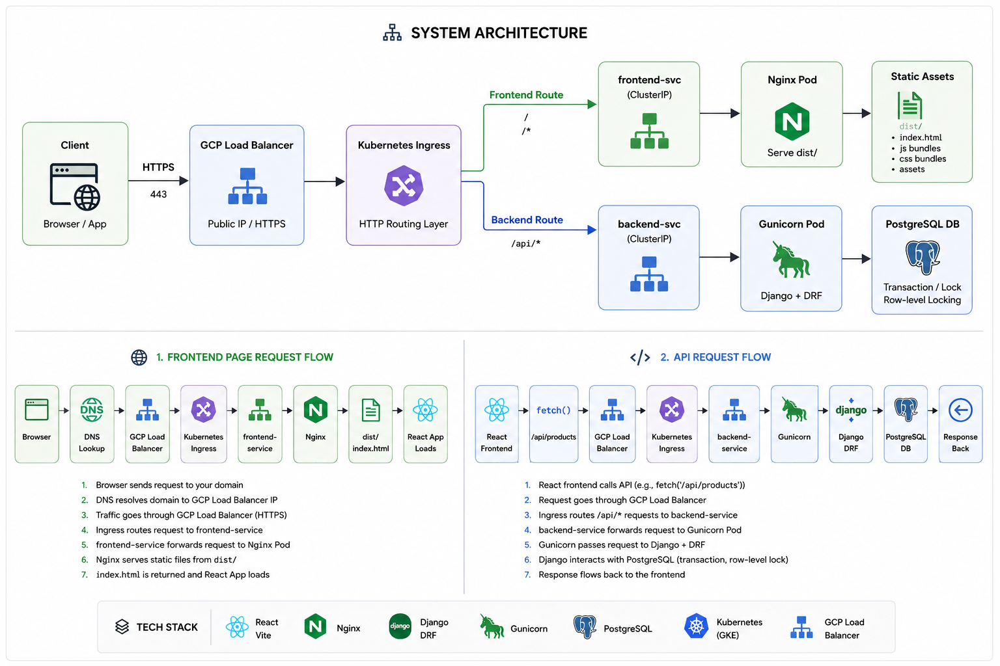

# Auction System


<p align="center">
  
</p>

A production-oriented auction backend system built with **Django REST Framework**.

This project simulates a real-world auction platform and focuses on backend engineering concerns such as:

- concurrency-safe bidding logic
- transactional integrity
- RESTful API design
- containerized deployment
- CI/CD automation
- Kubernetes-based cloud deployment

The system is designed to demonstrate how a backend service can be built, tested, containerized, and deployed using modern backend engineering practices.

---

# Tech Stack

**Backend**

- Python
- Django
- Django REST Framework

**Database**

- PostgreSQL
- Django ORM

**Infrastructure**

- Docker
- Docker Compose
- Kubernetes (GKE)
- Gunicorn

**DevOps**

- GitHub Actions
- Docker Hub
- CI/CD pipeline
- Automated Kubernetes deployment

**API Documentation**

- OpenAPI 3.0
- Swagger UI
- drf-spectacular

---

# System Architecture
```
Client
   │
   ▼
Django REST API
   │
   ├── Authentication Layer (JWT)
   │
   ├── Business Logic
   │      └── Concurrency-safe bidding
   │
   ├── ORM
   │
   ▼
PostgreSQL
```

Production deployment

```
GitHub
   │
   ▼
GitHub Actions (CI/CD)
   │
   ├── Run tests
   ├── Build Docker image
   ├── Push image to Docker Hub
   │
   ▼
Google Kubernetes Engine
   │
   ├── Deployment
   ├── Replica pods
   └── Rolling updates
```
---

# Features

## Authentication (JWT)

- User registration
- Login with JWT
- Token refresh
- Authenticated user profile endpoint
- Stateless authentication

Key concepts demonstrated

- token-based authentication
- secure password hashing
- request authentication pipeline

---

## Product API

RESTful endpoints for managing auction products.

Features

- authenticated product creation
- public product listing
- seller automatically derived from request user
- serializer-based validation
- permission-controlled write operations

---

## Concurrency-Safe Bidding System

The core engineering challenge in this project is handling concurrent bids safely.

Features

- only authenticated users can place bids
- bid must be greater than current highest bid
- atomic bid transactions
- prevention of race conditions

Implemented using

- transaction.atomic()
- select_for_update() row-level locking
- transactional updates

Concepts demonstrated

- transaction isolation
- pessimistic locking
- race condition prevention
- financial data consistency

---

## Relational Database Design


### Main entities
  - User  
  - Product  
  - Bid  

### Relationships
- User → Product (seller)  
- User → Bid (bidder)  
- Product → Bid  


### Design considerations

- referential integrity via foreign keys
- precise financial values using Decimal
- database consistency enforced through service layer

---

## API Testing

Automated tests verify core business rules.

Test coverage includes

- authentication requirements
- bid validation
- HTTP response correctness
- database state validation
- concurrency behavior

Testing tools

- Django APITestCase
- transaction-based tests
- multi-thread race condition simulations

---
# 📘 API Documentation (Swagger / OpenAPI)

Interactive API documentation is available via Swagger UI.

Access:

```
http://localhost:8000/api/docs/
```

Raw OpenAPI schema:

```
http://localhost:8000/api/schema/
```
---

# 🐳 Running with Docker (Recommended)

## 1. Clone repository

```bash
git clone https://github.com/kenhm25/web_app_auction
cd web_app_auction/
```

---

## 2. Build containers

```bash
docker compose build
```

---

## 3. Start services

```bash
docker compose up -d
```

---

## 4. Apply migrations

```bash
docker compose exec web python manage.py migrate
```

---


## 5. Run tests

```bash
docker compose exec web python manage.py test
```

---

## 6. Create superuser (optional)

```bash
docker compose exec web python manage.py createsuperuser
```

---

## 7. Stop services

```bash
docker compose down
```

---

API will be available at:
http://localhost:8000/api/docs/


---

# Frontend Showcase

A separate frontend has been added under `frontend/` to present the backend project like a product landing page and demo environment.

## Frontend stack

- React
- Vite
- TypeScript
- Tailwind CSS

## Frontend pages

- `/` overview landing page
- `/demo` API-backed interaction page
- `/architecture` backend and deployment explanation page

## Run the frontend locally

If you want to run the frontend outside Docker:

```bash
cd frontend
pnpm install
pnpm dev
```

## Run the frontend in Docker development mode

If you want to avoid installing Node.js locally, run the full stack with Docker:

```bash
docker compose up --build
```

Local URLs:

- Frontend: `http://localhost:5173`
- Backend API: `http://localhost:8000`
- Swagger docs: `http://localhost:8000/api/docs/`

---

# 🧪 Example API Flow (Manual Testing)

## 1️⃣ Register

```bash
curl -X POST http://localhost:8000/api/register/ \
  -H "Content-Type: application/json" \
  -d '{
    "username": "test_user",
    "email": "test@test.com",
    "password": "strongpassword123"
  }'
```

---

## 2️⃣ Login

```bash
curl -X POST http://localhost:8000/api/token/ \
  -H "Content-Type: application/json" \
  -d '{
    "username": "test_user",
    "password": "strongpassword123"
  }'
```

---

## 3️⃣ Access Protected Endpoint

```bash
curl http://localhost:8000/api/me/ \
  -H "Authorization: Bearer YOUR_ACCESS_TOKEN"
```

---

## 4️⃣ Create Product

```bash
curl -X POST http://localhost:8000/api/products/ \
  -H "Authorization: Bearer YOUR_ACCESS_TOKEN" \
  -H "Content-Type: application/json" \
  -d '{
    "title": "MacBook Pro",
    "description": "M1 16GB",
    "starting_bid": "20000.00",
    "location": "Taipei"
  }'
```

---

## 5️⃣ Place Bid

```bash
curl -X POST http://localhost:8000/api/products/1/bids/ \
  -H "Authorization: Bearer YOUR_ACCESS_TOKEN" \
  -H "Content-Type: application/json" \
  -d '{
    "bid_amount": "25000.00"
  }'
```

---

# CI/CD Pipeline

The project uses **GitHub Actions** to automate build, test, and deployment.

Pipeline workflow

1. Run automated tests
2. Build Docker image
3. Push image to Docker Hub
4. Deploy new version to Kubernetes
5. Perform rolling update

Deployment target

- Google Kubernetes Engine (GKE)

This setup simulates a simplified production deployment pipeline.

---

# Kubernetes Deployment

The application runs inside a Kubernetes cluster.

Deployment configuration includes

- multiple replicas
- containerized Django service
- Gunicorn production server
- rolling updates during deployment

This demonstrates how a backend API can be deployed in a scalable container orchestration environment.

---

# Deploying to Google Kubernetes Engine (GKE)

This project can be deployed to **Google Kubernetes Engine (GKE)** using the CI/CD pipeline configured in GitHub Actions.

The pipeline automatically:

1. Builds the Docker image
2. Pushes the image to Docker Hub
3. Deploys the latest version to the Kubernetes cluster

The only requirement is that the **GKE cluster already exists**.

---

## 1. Create a GKE Cluster

Before deploying, create a Kubernetes cluster in GCP:

```bash
gcloud container clusters create auction-cluster \
  --region asia-east1 \
  --num-nodes 1
```

This command creates:

- A Kubernetes control plane
- A node pool with 1 VM node
- Networking and load balancing infrastructure

Cluster creation usually takes **3–5 minutes**.

---

## 2. Trigger Deployment via CI/CD

Once the cluster is ready, simply push code to the `main` branch:

```bash
git push
```

The GitHub Actions pipeline will automatically:

1. Run tests
2. Build the Docker image
3. Push the image to Docker Hub
4. Deploy the application to GKE

---

## 3. Verify Deployment

You can verify that the application is running using:

```bash
kubectl get pods
kubectl get services
kubectl get ingress
```

---

## 4. Shut Down the Cluster (Cost Control)

To avoid unnecessary cloud costs, delete the cluster when it is not in use:

```bash
gcloud container clusters delete auction-cluster \
  --region asia-east1
```

Cluster deletion typically takes **5–15 minutes**.

Deleting the cluster removes:

- Kubernetes control plane
- Node virtual machines
- Load balancers
- External IP addresses

This removes most GCP infrastructure costs (compute, load balancer, external IP).
Persistent disks may still remain and should be manually checked and deleted if unused.

---
Then check the disks use:

```bash
gcloud compute disks list
```

If any disks still running:

```bash
gcloud compute disks delete DISK_NAME --zone ZONE
```
---

## 5. Redeploy Later

To redeploy the application later:

1. Recreate the cluster with 50GB standard persistent disk (node disk).

```bash
gcloud container clusters create auction-cluster \
  --region asia-east1 \
  --num-nodes 1 \
  --disk-type pd-standard \
  --disk-size 50
```

> Note: This configures the node disk.
Application data (PostgreSQL) uses separate persistent volumes.

2. Ensure the CI/CD pipeline is configured with cluster credentials before triggering deployment.
Alternatively, apply Kubernetes manifests manually:

```bash
git push
```
or

```bash
kubectl apply -f k8s/
```
 


The CI/CD pipeline will automatically deploy the application again.


# Engineering Concepts Demonstrated

- RESTful API design
- stateless authentication (JWT)
- transactional database operations
- race condition prevention
- relational database modeling
- containerized services
- automated CI/CD pipelines
- Kubernetes-based deployment
- layered backend architecture

---


# Author

Ken Hu

GitHub

https://github.com/kenhm25
