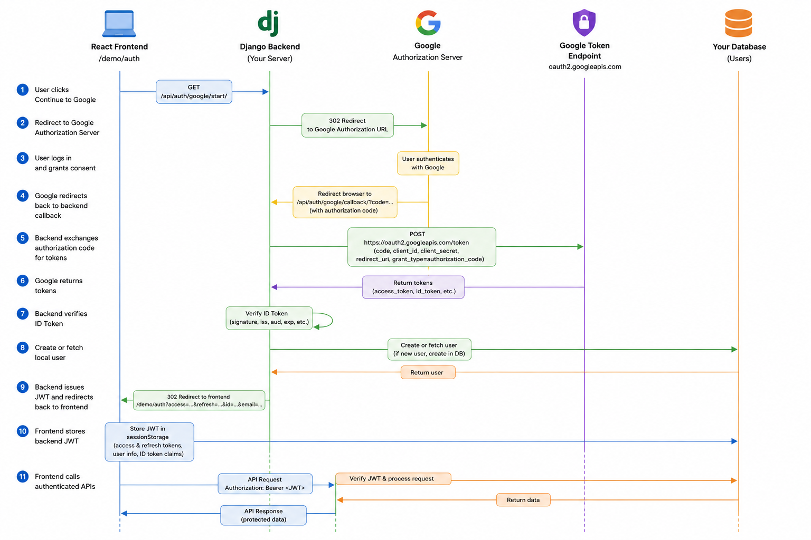
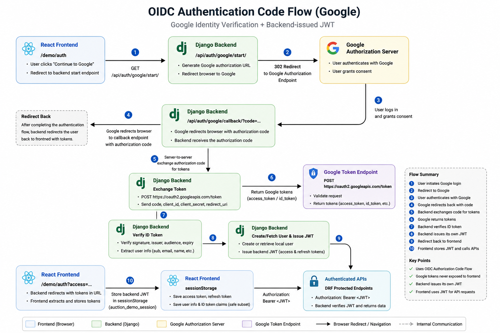

# Auction Platform


Production-oriented auction platform focused on authentication architecture, transaction safety, API observability, and Kubernetes deployment.

**Google OIDC · JWT Authentication · PostgreSQL Row Locking · Django REST Framework · React · Docker · Kubernetes · GKE**

This repository is designed as a backend engineering showcase. The auction domain is intentionally simple; the engineering focus is on secure identity boundaries, stateless API authentication, concurrency-safe writes, traceable API behavior, and cloud-ready deployment architecture.

---

## System Showcase

<p align="center">
  
</p>

<p align="center">
  
</p>

<p align="center">
  
</p>

---

## Engineering Highlights

- **Backend-controlled Google OIDC Authorization Code Flow**: the backend owns the provider token exchange, verifies the Google ID token, and issues application JWTs.
- **Stateless JWT authentication**: API requests use DRF SimpleJWT bearer tokens, with frontend auth state persisted in `sessionStorage` and shared through React Context.
- **Concurrency-safe bidding**: bid writes protect the highest-bid invariant with `transaction.atomic()` and PostgreSQL row-level locking via `select_for_update()`.
- **API trace visualization**: the frontend includes an API trace drawer for inspecting request/response payloads, auth events, OIDC handoff, and backend token issuance.
- **Production-oriented deployment shape**: React/Vite frontend, Django REST API, PostgreSQL, Docker images, Gunicorn runtime, Kubernetes Services, Ingress, and GKE deployment.

---

## Design Decisions

- Backend-controlled OIDC flow instead of frontend-only OAuth handling.
- Backend-issued JWTs instead of exposing raw Google tokens to the browser.
- Stateless bearer-token API authentication instead of server-side session storage.
- PostgreSQL row-level locking for bid consistency under concurrent writes.
- API trace visualization for auth/debug observability during demos and reviews.
- Container-first deployment architecture targeting Kubernetes/GKE.

---

## Architecture Overview

The system separates product interaction, authentication, business rules, persistence, and deployment concerns into clear layers.

```text
Browser
  -> React + Vite frontend
  -> Django REST Framework API
  -> Authentication and business logic layer
  -> PostgreSQL
```

The frontend is responsible for user interaction, API trace visualization, and storing only the backend-issued JWT. The backend owns identity verification, authorization, serializer validation, bid consistency, and database writes. PostgreSQL is used as the consistency boundary for transactional auction state.

### Runtime Components

| Layer | Responsibility | Technology |
| --- | --- | --- |
| Frontend | Demo UI, auth state, API trace drawer | React, TypeScript, Vite |
| Backend API | Auth, product APIs, bid transaction logic | Django, Django REST Framework |
| Authentication | JWT issuance and bearer-token API auth | DRF SimpleJWT, Google OIDC |
| Database | Auction state and transactional consistency | PostgreSQL |
| Runtime | Containerized API process | Docker, Gunicorn |
| Deployment | Service routing and rollout | Kubernetes, GKE, Ingress, Services |

---

## Authentication Architecture

The application supports both local JWT login and Google OIDC login while keeping the token boundary explicit.

### JWT API Authentication

- Login returns backend-issued SimpleJWT access and refresh tokens.
- API requests use `Authorization: Bearer <access_token>`.
- Frontend auth state is persisted in `sessionStorage`.
- React Context shares authenticated user state across the frontend.

### Google OIDC Authorization Code Flow

The backend owns the OIDC token exchange and ID token verification process so provider credentials and raw Google tokens never reach the browser.

```text
React frontend
  -> backend /auth/google/start/
  -> Google authorization endpoint
  -> backend /auth/google/callback/?code=...
  -> Google token endpoint
  -> ID token verification
  -> backend-issued JWT
  -> frontend sessionStorage
```

Key properties:

- The frontend starts the flow through the backend, not directly against Google's token endpoint.
- The backend exchanges the authorization code for Google tokens server-side.
- The backend verifies the Google ID token audience and claims.
- The backend creates or loads the application user.
- The backend issues its own JWT pair for API authorization.
- The frontend stores only the application JWT, not raw provider access tokens.

This keeps provider tokens, client secrets, and identity verification logic inside the trusted backend boundary.

---

## Concurrency-Safe Bidding

The highest bid is treated as a contention-sensitive invariant.

Concurrent writes are serialized with PostgreSQL row-level locking using `transaction.atomic()` and `select_for_update()`. When a bid request arrives, the backend locks the target product row, compares the incoming amount against the current highest bid, updates the product, and records the bid inside the same transaction.

```python
with transaction.atomic():
    product = get_object_or_404(
        Product.objects.select_for_update(),
        id=product_id,
    )

    if bid_amount <= product.current_highest_bid:
        return Response({"detail": "Bid must be greater than current highest bid."}, status=400)

    Product.objects.filter(id=product_id).update(current_highest_bid=bid_amount)
    Bid.objects.create(product_id=product_id, bidder=request.user, bid_amount=bid_amount)
```

This design prevents lost updates when multiple clients bid on the same product at nearly the same time. The database, not application timing, is used as the source of consistency.

---

## API Observability

The frontend includes an API trace drawer that makes backend behavior inspectable during demos and engineering review.

It visualizes:

- API request method, route, payload, and response.
- JWT-backed authenticated requests.
- Google OIDC redirect, callback, token exchange, ID token verification, and backend JWT issuance.
- Bid and product API interactions.

This is intentionally closer to internal tooling than a static demo page: it makes the auth pipeline and request lifecycle visible instead of treating the API as a black box.

---

## Deployment Architecture

The deployment stack is container-first and Kubernetes-oriented.

```text
GitHub Actions
  -> backend/frontend validation
  -> Docker image build
  -> Docker Hub push with immutable SHA tags
  -> GKE rollout
  -> Kubernetes Deployment + Service + Ingress
```

Production-shaped components:

- Backend image runs Django through Gunicorn.
- Frontend image serves the React build through Nginx.
- PostgreSQL runs as a Kubernetes stateful workload.
- Backend and frontend are exposed through Kubernetes Services.
- Ingress routes external traffic to the frontend and API.
- GitHub Actions validates backend tests and frontend builds before deployment.
- GKE deployment uses immutable git SHA image tags so each rollout is traceable to a source revision.

---

## Technology Stack

| Area | Stack |
| --- | --- |
| Frontend | React, TypeScript, Vite, Tailwind CSS |
| Backend | Python, Django, Django REST Framework |
| Authentication | Google OIDC Authorization Code Flow, DRF SimpleJWT |
| Database | PostgreSQL, Django ORM |
| API Docs | OpenAPI 3.0, Swagger UI, drf-spectacular |
| Runtime | Docker, Docker Compose, Gunicorn, Nginx |
| Deployment | Kubernetes, Google Kubernetes Engine, Ingress, Services |
| CI/CD | GitHub Actions, Docker Hub |

---

## Local Development

Run the full stack with Docker Compose:

```bash
docker compose up --build
```

Local services:

- Frontend: `http://localhost:5173`
- Backend API: `http://localhost:8000`
- Swagger UI: `http://localhost:8000/api/docs/`
- OpenAPI schema: `http://localhost:8000/api/schema/`

Backend commands:

```bash
docker compose exec web python manage.py migrate
docker compose exec web python manage.py test
docker compose exec web python manage.py createsuperuser
```

Run the frontend outside Docker:

```bash
cd frontend
pnpm install
pnpm dev
```

---

## API Documentation

Interactive API documentation is available through Swagger UI:

```text
http://localhost:8000/api/docs/
```

Raw OpenAPI schema:

```text
http://localhost:8000/api/schema/
```

---

## Repository Structure

```text
.
├── auctionsite/              # Django project and DRF application
├── frontend/                 # React/Vite frontend and API trace UI
├── k8s/                      # Kubernetes manifests for backend, frontend, PostgreSQL, Ingress
├── .github/workflows/        # CI/CD validation, image build, and GKE deployment
├── docker-compose.yml        # Local full-stack development
├── Dockerfile                # Backend container image
├── OIDC_arch.png             # OIDC architecture diagram
├── OIDC_flow.png             # OIDC authorization code flow diagram
└── system_arch.png           # System architecture diagram
```

---

## Author

Ken Hu

GitHub: https://github.com/kenhm25
