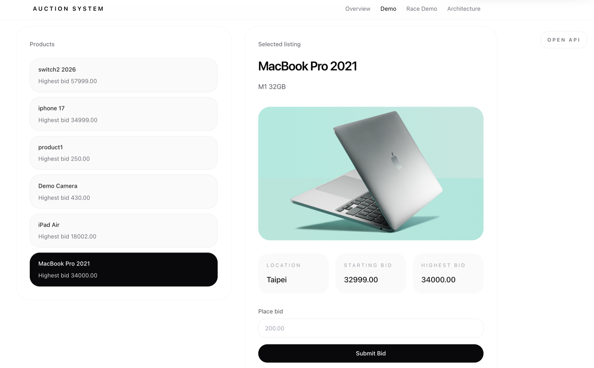
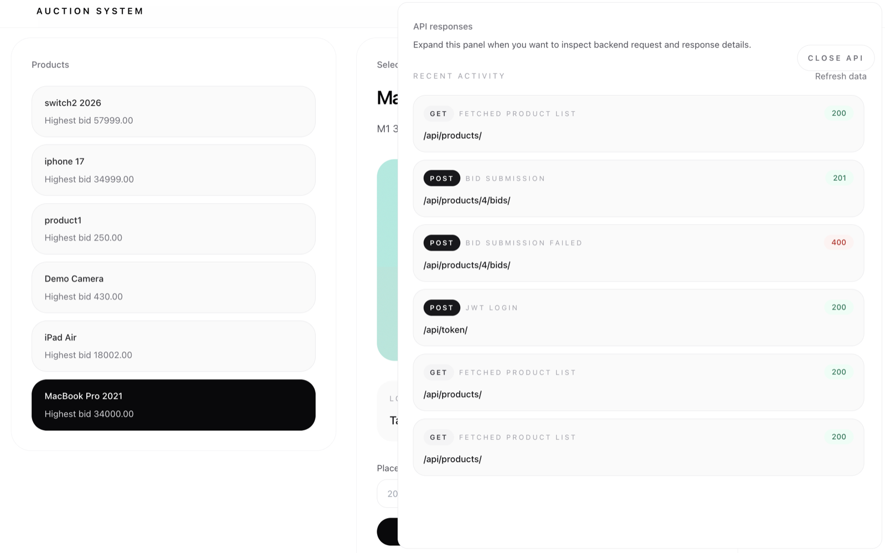

# Auction Platform


Production-oriented auction platform focused on transactional consistency, stateless API architecture, and Kubernetes-native deployment.

**Django REST Framework · JWT APIs · PostgreSQL Row-Level Locking · React · Docker · Gunicorn · Kubernetes · GKE · OpenAPI**

This project focuses on backend engineering concerns such as transactional consistency, authentication boundaries, deployment architecture, and API documentation. The auction domain is intentionally compact so the system design, data consistency model, and deployment shape remain easy to inspect.

---

## System Architecture

<p align="center">
  
</p>

The application is split into a React frontend, a Django REST Framework API, and a PostgreSQL persistence layer. The backend owns request validation, authentication, auction write rules, and transactional consistency. The frontend consumes the API through a stateless REST boundary and presents the backend system through a small product interface.

```text
Client
  -> React + Vite frontend
  -> Django REST Framework API
  -> Authentication and transaction boundary
  -> PostgreSQL
```

---

## Engineering Highlights

- **Transactional bid consistency**: bid placement protects the highest-bid invariant with `transaction.atomic()` and `select_for_update()`.
- **Stateless REST API boundary**: authenticated requests use JWT bearer tokens instead of server-side session state.
- **PostgreSQL-backed correctness**: auction state is stored in a relational model with foreign keys, decimal bid values, and row-level locking.
- **Containerized runtime**: backend and frontend are packaged as Docker images; the API runs behind Gunicorn.
- **Kubernetes-native deployment**: workloads are exposed through Services and Ingress routing, with manifests for backend, frontend, and PostgreSQL.
- **Concurrency test coverage**: transaction-aware tests verify that competing bid writes preserve the highest-bid invariant.
- **API documentation**: OpenAPI schema and Swagger UI are generated through `drf-spectacular`.

---

## Design Decisions

- Treat the highest bid as a database consistency invariant, not only an application-level check.
- Use PostgreSQL row-level locking to serialize competing bid writes on the same product.
- Keep the API stateless with JWT authentication and bearer-token authorization.
- Test concurrent bid behavior with transaction-aware backend tests, not only single-request API tests.
- Separate frontend, backend, and database workloads for containerized deployment.
- Route traffic through Kubernetes Services and Ingress instead of binding directly to pods.
- Validate backend tests and frontend production builds before deployment.

---

## Architecture Overview

| Layer | Responsibility | Technology |
| --- | --- | --- |
| Frontend | Product demo UI, API-backed interaction, architecture pages | React, TypeScript, Vite |
| Backend API | REST endpoints, authentication, validation, business rules | Django, Django REST Framework |
| Authentication | Registration, JWT login, protected API access | DRF SimpleJWT |
| Consistency Layer | Bid validation, atomic writes, row-level locking | Django transactions, PostgreSQL |
| Database | Products, bids, users, relational constraints | PostgreSQL, Django ORM |
| Runtime | Containerized services and API process management | Docker, Docker Compose, Gunicorn |
| Deployment | Workload orchestration, service routing, rollout | Kubernetes, Ingress, Services, GKE |

The backend exposes a small but production-shaped API surface: user registration, JWT login, product listing/creation, authenticated bid placement, and user profile access. The implementation keeps business rules close to the transaction boundary so correctness does not depend on client behavior or request timing.

---

## Concurrency-Safe Bidding

The highest bid is treated as a contention-sensitive invariant.

Concurrent bid submissions are serialized using PostgreSQL row-level locking with `transaction.atomic()` and `select_for_update()` to prevent lost updates and inconsistent auction state.

```python
with transaction.atomic():
    product = get_object_or_404(
        Product.objects.select_for_update(),
        id=product_id,
    )

    if bid_amount <= product.current_highest_bid:
        return Response(
            {"detail": f"Bid must be greater than {product.current_highest_bid}."},
            status=400,
        )

    Product.objects.filter(id=product_id).update(current_highest_bid=bid_amount)
    bid = Bid.objects.create(
        product_id=product_id,
        bidder=request.user,
        bid_amount=bid_amount,
    )
```

The transaction boundary is intentionally narrow:

1. Validate the incoming bid payload.
2. Open an atomic transaction.
3. Lock the target product row.
4. Compare against the current highest bid.
5. Update the product and create the bid record.
6. Commit the write as one consistency unit.

This makes PostgreSQL the source of truth for concurrent write ordering, which is the critical property for an auction system.

---

## Interactive Demo UI

The frontend is designed as an API interaction surface for the backend system. It keeps the auction workflow lightweight while making JWT-authenticated requests, backend validation behavior, request/response payloads, and transaction-aware bid flows easier to inspect.

### Product Interaction Surface

The product view keeps the current auction state visible while authenticated users create listings and submit bids through the DRF API.

<p align="center">
  
</p>

### API Trace Drawer

The API drawer exposes recent backend interactions so request methods, payloads, responses, and validation outcomes can be reviewed without leaving the demo flow.

<p align="center">
  
</p>

---

## Testing Strategy

The backend test suite validates API behavior, authentication requirements, and the concurrency guarantees around bid placement.

Test coverage includes:

- API validation for product and bid endpoints.
- JWT-protected endpoint access.
- Bid amount validation against the current highest bid.
- Database state assertions after successful writes.
- Concurrent bid submission using multiple clients and independent database transactions.

The concurrency test uses `TransactionTestCase` to exercise transactional behavior against PostgreSQL. The expected invariant is that the final `current_highest_bid` matches the highest accepted bid, even when competing requests target the same product at nearly the same time.

CI validates backend transactional behavior against PostgreSQL before container image publication and Kubernetes rollout.

---

## Deployment Architecture

The platform is deployed as containerized workloads behind Kubernetes Services and Ingress routing.

```text
GitHub Actions
  -> backend tests and frontend build validation
  -> Docker image build
  -> Docker Hub push
  -> Kubernetes rollout
  -> Service + Ingress traffic routing
```

Deployment components:

- Django API container running with Gunicorn.
- React frontend container served through Nginx.
- PostgreSQL stateful workload with persistent storage.
- Backend and frontend Kubernetes Services.
- Ingress routing `/api` traffic to the backend and `/` traffic to the frontend.
- GitHub Actions pipeline for validation, image build, push, and GKE rollout.
- Immutable git SHA image tags for traceable deployments.

GKE is used as the managed Kubernetes target, but the deployment model is expressed through standard Kubernetes primitives.

---

## Technology Stack

| Area | Stack |
| --- | --- |
| Backend | Python, Django, Django REST Framework |
| Frontend | React, TypeScript, Vite, Tailwind CSS |
| Authentication | JWT, DRF SimpleJWT |
| Database | PostgreSQL, Django ORM |
| API Documentation | OpenAPI 3.0, Swagger UI, drf-spectacular |
| Runtime | Docker, Docker Compose, Gunicorn, Nginx |
| Deployment | Kubernetes, Services, Ingress, GKE |
| CI/CD | GitHub Actions, Docker Hub |

---

## Local Development

Run the full stack:

```bash
docker compose up --build
```

Local services:

- Frontend: `http://localhost:5173`
- Backend API: `http://localhost:8000`
- Swagger UI: `http://localhost:8000/api/docs/`
- OpenAPI schema: `http://localhost:8000/api/schema/`

Useful backend commands:

```bash
docker compose exec web python manage.py migrate
docker compose exec web python manage.py test
docker compose exec web python manage.py createsuperuser
```

Run the frontend separately:

```bash
cd frontend
pnpm install
pnpm dev
```

---

## API Documentation

Interactive API documentation is available through Swagger UI:

```text
http://localhost:8000/api/docs/
```

Raw OpenAPI schema:

```text
http://localhost:8000/api/schema/
```

---

## Repository Structure

```text
.
├── auctionsite/              # Django project and DRF application
├── frontend/                 # React/Vite frontend
├── k8s/                      # Kubernetes manifests for API, frontend, PostgreSQL, Services, Ingress
├── .github/workflows/        # CI/CD validation, image build, and deployment workflow
├── docker-compose.yml        # Local full-stack runtime
├── Dockerfile                # Backend image definition
└── assets/readme/            # README architecture and demo screenshots
```

---

## Author

Ken Hu

GitHub: https://github.com/kenhm25
